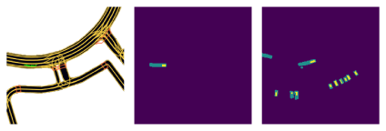
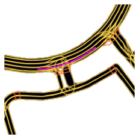
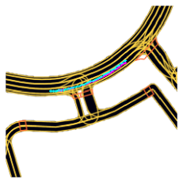
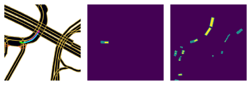
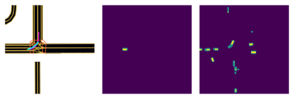
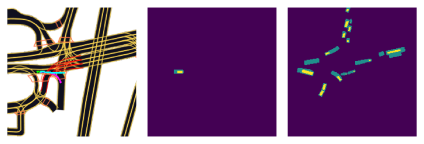
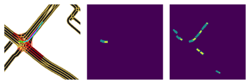
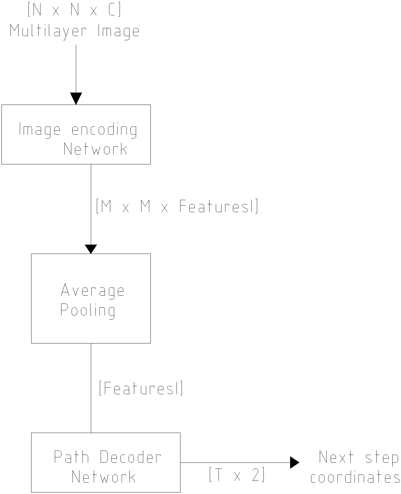

# Semester Project
1. [Overview](#Overview)
2. [Code Description](#Code_Description)

# Overview

Multi-target tracking in Clutter environment is NP-Hard problem.So,Deep Convolutional Neural Network based algorithm is proposed to solve this combinatorial optimization problem.In classical data association methods, prior knowledge is related to target to be tracked is needed to estimate future states of target such as target state-covariance,gate size etc but Neural Network based algorithm is capable of solving this problem without prior knowledge. What it does is find probability matrix between measurements and targets using supervised learning based approach.To demonstrate the capabilties of neural network we applied the neural network based algorithm on LYFT dataset.

In this problem we have to estimate the future positions of a given agent (car, pedestrian or cyclist). The prediction had to extend 5 s into the future. The input information was an aerial map of the terrain, a semantic map, the position of the agent in the map, the position of other agents in the map and the history positions of the agents (around 10 s into the past). The expected use of this network is to estimate future positions of agents around an autonomous vehicle.

To train the models, Lyft provided a [big dataset](https://self-driving.lyft.com/level5/download/), a [nice library](https://github.com/lyft/l5kit) and [documentation](https://lyft.github.io/l5kit/).

### Results

The first image is the input semantic map, followed by the fade image of the Ego agent (the agent to be predicted) and the fade image of the other agents. In the semantic map the historical positions are marked in green (actually the network receives them as value data). The expected output of this sample is:

where the target path is shown in pink (?). The output of the network was the following (in cyan):

Some other examples:

ok:

under shot:

crashed (it forgot to turn):

ok (here it turned ok, because it was already turning):

### Model

The base model is a model based on the Lyft baseline, it is composed of a convolutional network for feature extraction, an average pooling layer and a fully connected layer for predicting each next step. The network only predicts a fixed amount of future steps and ignores the history positions.

The input is an image of size NxN with 3 RGB channels from the semantic or aerial map, one channel for the current Ego position, one channel for the current agents positions and two additional channels for each history point, with the Ego and Agents positions. The input is fed to the *Image Encoding Network* (a pre-trained convolutional neural network), then its outputs are averaged and a feature tensor is obtained, which is fed to the *Path Decoder Network*, consisting of two fully connected layers. The output is a vector of coordinates with T time steps.

### Requirements

The training of the model requires:
* CPU RAM >= 16 GB
* GPU RAM >= 12 GB (or more for the Base model)
* CUDA CAPABILITY > 3.6

The training times will largely depend on the CPU speed (GPU for the base model). A solid state storage unit is advised but not required.
### Training and Testing

To train and test the model execute the following python file:
* *./CV_Project.py*

At the end of the above file some plotting functions are provided.

